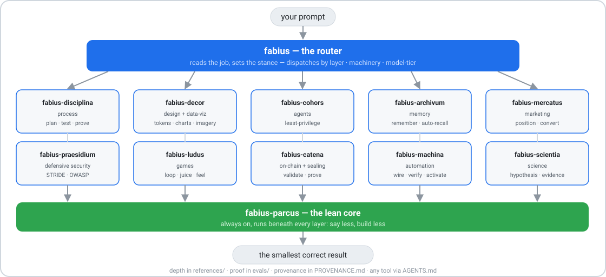

<div align="center">

# ⚔️ fabius — the super-skill

### One skill that equips Claude **end to end.**

*Write code · write prose · build agents · design UI · debug · remember — one stance behind all of it.*

<br/>


<br/>
<br/>

[](https://docs.anthropic.com/en/docs/claude-code)
[](#-what-it-is)
[](#%EF%B8%8F-architecture)
[](#-the-one-idea)
[](#-license)

</div>

---

## 🎯 What it is

**fabius is a super-skill** — one skill you hand the agent that equips it **end to end**: write code, write prose, build agents, design UI, debug, and remember. Not a menu you pick from — a single stance the agent runs the whole job under:

> 🗜️ **talks lean** · 🪶 **builds lean** · 🧪 **ships verified** · 🎨 **designs at ship quality** · 🤖 **builds other agents** · 🧠 **stops re-deriving**

Named for the Fabian doctrine — *scout the whole field, fight only the battle that matters* (the [`fabius`](skills/fabius/SKILL.md) skill carries the full story).

One system — six coordinated, non-overlapping skills: an always-on lean core (`fabius-parcus`), a router (`fabius`), and four engineering specialists. Install **one thing**; the agent works end to end.

---

## ⚡ What it does — and the numbers

Same model, one concentrated set of operating rules. The stance changes the *shape* of the output across every kind of work:

| You ask for… | Typical model default | With fabius |
|---|---|---|
| **Code** | verbose, over-engineered, may skip validation | minimal + surgical, validation/security kept |
| **A bug fix** | patches the symptom | reproduce → root cause → regression test |
| **UI** | inline styles, inconsistent, desktop-first | design tokens, one accent, mobile-first, a11y |
| **An agent** | broad tools, vague role | least-privilege, precise output contract |
| **An explanation** | padded, hedged | tight, exact, no filler |
| **Research / memory** | re-derives every time | written down once, retrieved next time |

### 📊 Measured, blind, reproducible

A three-arm eval — `baseline` · a generic *"be concise"* · the full fabius stance — scored by a judge model **never told which arm wrote which answer.** Beating "be concise" is the real test; fabius beats it on every tier *while cutting output*:

| Model | baseline | terse | **fabius** | vs terse | output cut |
|---|---|---|---|---|---|
| **Opus 4.8**   | 12.5 | 13.0 | **13.88** | **+0.88** | **−43%** |
| **Sonnet 4.6** | 8.75 | 11.75 | **12.5** | **+0.75** | **−52%** |
| **Haiku 4.5**  | 8.88 | 9.13 | **10.38** | **+1.25** | **−32%** |

Across four model families (**Grok · Mistral · GPT · Claude**) the shape repeats: **fabius beats plain terseness on every non-trivial task — largest at trust / order / genuine-build boundaries, ~zero at pure YAGNI.** Shorter answers the blind judge scores *higher*.

> The honest headline: **structure beats brevity, and the lift grows as the model's default gets less disciplined.** Not "smarter." Not "10× on everything." Run it on your own model → **[BENCHMARKS.md](BENCHMARKS.md)**.

---

## 🏗️ Architecture

One router over an always-on lean core and four specialists, on a thin spine (`references/` deep-dives · `evals/` benchmark · `AGENTS.md` cross-tool bridge). Process picks *how*, domain picks *what*; the lean core runs underneath everything.

<div align="center">

</div>

Full layer model, the single-owner coordination table, and the capability matrix: **[ARCHITECTURE.md](ARCHITECTURE.md)**.

---

## 📦 What you get

| | Skill | Role | What it delivers |
|---|---|---|---|
| ⚔️ | **fabius** | router / super-skill | reads the job, sets the stance, pulls the right layer |
| 🪶 | **fabius-parcus** | always-on lean core | terse output · YAGNI ladder · surgical changes · no speculative scope |
| ⚙️ | **fabius-disciplina** | engineering process | brainstorm → plan → test-first → prove · grill ambiguity · root-cause debugging |
| 🎨 | **fabius-decor** | design system | one-accent laws · token vocabulary · mobile-first · live-verify checklist |
| 🤖 | **fabius-cohors** | agent engineering | definition schema · least-privilege permissions · 4 orchestration patterns |
| 🧠 | **fabius-archivum** | persistent memory | write-it-down-once memory · index + log retrieval · when to go vector |

Each skill is a thin operating contract; the depth — a 69-brand design teardown library, a 200+-agent production catalog with `ruvector.db` memory, a knowledge engine (vector · wiki · RAG), and the full craft + discipline process library — lives under each skill's `references/`, loaded **on demand**, so the skill itself stays lean.

*Latin, for the curious: **parcus** frugal · **disciplina** training · **decor** what is fitting · **cohors** the cohort · **archivum** the record office.*

---

## 💡 The one idea

One axis dissolves the "be thorough vs. be minimal" tension:

<div align="center">

### 🔭 Scout wide in what you investigate. &nbsp; 🎯 Strike narrow in what you ship.

</div>

Fan out to understand and verify. Ship the smallest correct artifact. Explain it in the fewest words. **Process** and **memory** make you wide; **lean** makes you narrow. They never fight — they live on different axes.

---

## 🚀 Install

A standard Claude Code plugin — zero build, zero config.

```bash
# 1. add this repo as a marketplace
/plugin marketplace add ArielShemesh1999/fabius

# 2. install
/plugin install fabius
```

Or drop any single `skills/<name>/` folder straight into a project's `.claude/skills/`.

Then **start any task with the `fabius` skill** — it loads the stance and routes to the rest. The other skills also self-surface by description:

```text
write code         → fabius-parcus
build a feature    → fabius-disciplina
build UI / a page  → fabius-decor
build an agent     → fabius-cohors
remember this      → fabius-archivum
```

---

## 🔌 Any agent, any tool

fabius is **plain-markdown skills** — model- and tool-agnostic. The portable bridge is [`AGENTS.md`](AGENTS.md): copy it into your repo (or paste it into your tool's rules) and the agent operates under fabius end to end.

| Tool | How to install |
|---|---|
| **Claude Code** | `/plugin install fabius` — full 6 skills + progressive disclosure |
| **Codex / OpenAI** | drop [`AGENTS.md`](AGENTS.md) at repo root (Codex reads it automatically) |
| **OpenCode** | `AGENTS.md` at repo root, or copy `skills/` into `.opencode/` |
| **Cursor** | copy `AGENTS.md` (or a skill body) into `.cursor/rules/fabius.mdc` |
| **Windsurf** | `.windsurf/rules/fabius.md` |
| **Cline** | `.clinerules/fabius.md` |
| **GitHub Copilot** | `.github/copilot-instructions.md` (or `AGENTS.md`) |
| **Gemini CLI** | `GEMINI.md` at repo root |
| **Any LLM / raw prompt** | paste `AGENTS.md` (or a single `SKILL.md`) into the system prompt |

---

## 🗂️ Structure

```text
fabius/
├── .claude-plugin/
│   ├── plugin.json              # plugin manifest
│   └── marketplace.json         # marketplace manifest
├── skills/
│   ├── fabius/                  # ⚔️ router / super-skill
│   ├── fabius-parcus/           # 🪶 always-on lean core
│   ├── fabius-disciplina/       # ⚙️ engineering process
│   │   └── references/          #    playbook + process/ (craft + discipline skill library)
│   ├── fabius-decor/            # 🎨 design system
│   │   └── references/          #    token contract + design/ (69-brand teardown library)
│   ├── fabius-cohors/           # 🤖 agent engineering
│   │   └── references/          #    schema + agents/ (200+ agent catalog + ruvector.db)
│   └── fabius-archivum/         # 🧠 persistent memory
│       └── references/          #    wiki schema + knowledge/ (vector · wiki · RAG)
├── evals/                       # eval.mjs · portable_eval.py · harness.workflow.js · results.json
├── AGENTS.md                    # 🔌 tool-agnostic bridge (Codex / Cursor / …)
├── ARCHITECTURE.md              # layer model + single-owner table + capability matrix
├── BENCHMARKS.md                # method + mechanism + reproduce
├── LICENSE                      # MIT
└── README.md
```

---

## 🛡️ Boundaries

Lean is a **discipline, not a corner-cutter** — it never trims validation, security, accessibility, or data-loss handling. The full never-trim list is owned by [fabius-parcus → *When NOT to be lean*](skills/fabius-parcus/SKILL.md#when-not-to-be-lean).

`fabius` governs **how** the agent works, never **what** you want: your instruction always wins, and `stop fabius` / `normal mode` reverts the stance.

---

## 📄 License

fabius is licensed **MIT**.

<div align="center">
<br/>
<sub>Built by <a href="https://github.com/ArielShemesh1999">Ariel Shemesh</a> · one folder, the whole stack · scout wide, strike narrow.</sub>
</div>
