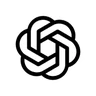
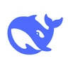
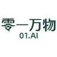
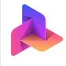
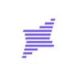

<div align="center">


#### scout wide · strike narrow

*A plugin, not a platform — one set of rules above every model.*

<br/>


<br/>
<br/>

[](#install-once-every-model-every-session)
[](#runs-above-every-model-exactly-the-same-rules)
[](BENCHMARKS.md)
[](paper/fabius-as-a-system.pdf)

</div>

---

## one set of rules. above every model.

fabius is a plugin — **fifteen coordinated skills and twenty-two proven routing rules**, loaded on top of whatever model you already run, inside the harness you already use. The model supplies the capability; fabius supplies the discipline. **You choose the goal; fabius chooses the machinery** — capability-first routing, research that stops the moment another step can no longer change the decision, verification before anything ships, and a memory that stops re-deriving. Nothing to host. Nothing to sign up for.

The contract is written down, not implied: the identity and how fabius must be judged (same model, better outcomes, less waste) is [IDENTITY.md](IDENTITY.md); the orchestration doctrine (the flow, provider selection, the stopping logic, the acting ladder) is [`skills/fabius/references/orchestration-doctrine.md`](skills/fabius/references/orchestration-doctrine.md); the site is **[fabius-landing.vercel.app](https://fabius-landing.vercel.app)**.

---

## Runs above every model. Exactly the same rules.

fabius has no model roster and no runtime of its own — it is a set of rules the harness hands to whichever model you choose. Frontier or open-weight, hosted, routed or local: the contract is identical. Thirty-six of the families it already runs above:

<table align="center"><tr>
<td align="center" title="Anthropic"><br/><sub><b>Claude</b></sub></td>
<td align="center" title="OpenAI"><br/><sub><b>GPT</b></sub></td>
<td align="center" title="Google"><br/><sub><b>Gemini</b></sub></td>
<td align="center" title="DeepSeek"><br/><sub><b>DeepSeek</b></sub></td>
<td align="center" title="Z.ai · Zhipu"><br/><sub><b>GLM</b></sub></td>
<td align="center" title="Alibaba"><br/><sub><b>Qwen</b></sub></td>
</tr><tr>
<td align="center" title="Meta"><br/><sub><b>Llama</b></sub></td>
<td align="center" title="Mistral AI"><br/><sub><b>Mistral</b></sub></td>
<td align="center" title="Moonshot AI"><br/><sub><b>Kimi</b></sub></td>
<td align="center" title="xAI"><br/><sub><b>Grok</b></sub></td>
<td align="center" title="Cohere"><br/><sub><b>Command</b></sub></td>
<td align="center" title="Google"><br/><sub><b>Gemma</b></sub></td>
</tr><tr>
<td align="center" title="Microsoft"><br/><sub><b>Phi</b></sub></td>
<td align="center" title="NVIDIA"><br/><sub><b>Nemotron</b></sub></td>
<td align="center" title="IBM"><br/><sub><b>Granite</b></sub></td>
<td align="center" title="Amazon"><br/><sub><b>Nova</b></sub></td>
<td align="center" title="Perplexity"><br/><sub><b>Sonar</b></sub></td>
<td align="center" title="MiniMax"><br/><sub><b>MiniMax</b></sub></td>
</tr><tr>
<td align="center" title="Tencent"><br/><sub><b>Hunyuan</b></sub></td>
<td align="center" title="Baidu"><br/><sub><b>ERNIE</b></sub></td>
<td align="center" title="ByteDance"><br/><sub><b>Seed</b></sub></td>
<td align="center" title="StepFun"><br/><sub><b>Step</b></sub></td>
<td align="center" title="01.AI"><br/><sub><b>Yi</b></sub></td>
<td align="center" title="TII"><br/><sub><b>Falcon</b></sub></td>
</tr><tr>
<td align="center" title="AI21 Labs"><br/><sub><b>Jamba</b></sub></td>
<td align="center" title="Reka AI"><br/><sub><b>Reka</b></sub></td>
<td align="center" title="Ai2"><br/><sub><b>OLMo</b></sub></td>
<td align="center" title="Nous Research"><br/><sub><b>Hermes</b></sub></td>
<td align="center" title="Liquid AI"><br/><sub><b>LFM</b></sub></td>
<td align="center" title="LG AI Research"><br/><sub><b>EXAONE</b></sub></td>
</tr><tr>
<td align="center" title="Upstage"><br/><sub><b>Solar</b></sub></td>
<td align="center" title="Xiaomi"><br/><sub><b>MiMo</b></sub></td>
<td align="center" title="Sarvam AI"><br/><sub><b>Sarvam</b></sub></td>
<td align="center" title="Hugging Face"><br/><sub><b>SmolLM</b></sub></td>
<td align="center" title="OpenAI · open weights"><br/><sub><b>GPT-OSS</b></sub></td>
<td align="center" title="Swiss AI"><br/><sub><b>Apertus</b></sub></td>
</tr></table>

<sub>Model, maker and platform marks identify compatible engines only ([sources](assets/brands/README.md)); example families change with each vendor's roster. No affiliation or endorsement is implied. Served any way you like — hosted, via a router, or local. Harnesses: **Claude Code · Codex · Grok Build** natively, anywhere else through [AGENTS.md](AGENTS.md).</sub>

---

## Install once. Every model, every session.

The rules load into the harness you already use. Free to install for personal use — the model you already run is the only thing that costs money.

**Claude Code**

```
/plugin marketplace add shear559/fabius
/plugin install fabius@fabius
/reload-plugins
```

Stay current automatically: `/plugin` → Marketplaces → fabius → **Enable auto-update**. Every release bumps the version, so updates arrive on their own.

**Codex** — add the git marketplace to `~/.codex/config.toml`:

```toml
[marketplaces.fabius]
source_type = "git"
source = "https://github.com/shear559/fabius.git"

[plugins."fabius@fabius"]
enabled = true
```

**Grok Build**

```
grok plugin install shear559/fabius --trust
grok plugin enable fabius
```

**Anywhere else** — Cursor, Windsurf, Cline, Copilot, Gemini CLI, OpenCode or a raw system prompt: carry [`AGENTS.md`](AGENTS.md) in at the path your tool reads, and the same rules apply. Without any harness, the repo ships a zero-dependency local runner for the same sealed rules — `node runtime/fabius.mjs run "…"` — read-only until you allow writes, holding anything irreversible even in autonomous mode.

---

## The system


**Fifteen coordinated, zero-overlap capability layers** — a router that dispatches by layer · machinery · model-tier, an always-on lean core, and thirteen specialists:

| Layer | Owns |
|---|---|
| `fabius` | the router — reads the job, picks the layers, the machinery rung, the model tier |
| `fabius-parcus` | the always-on lean core — terse output, the YAGNI ladder, surgical change |
| `fabius-disciplina` | engineering process — brainstorm → plan → TDD → prove, root-cause debugging |
| `fabius-decor` | ship-grade design — tokens, one accent, data-viz, decks + infographics, RTL |
| `fabius-cohors` | agent engineering — least privilege, orchestration up to a swarm |
| `fabius-archivum` | persistent memory — the LLM-wiki, auto-recall, meeting transcripts into records |
| `fabius-mercatus` | go-to-market — positioning, converting copy, SEO, draft-only outreach |
| `fabius-praesidium` | defensive security — STRIDE, OWASP, severity → fix → regression test |
| `fabius-ludus` | game craft — core loop first, deliberate juice, jam-sized scope |
| `fabius-catena` | on-chain + sealing — EVM/Solana money-safety, verifiable provenance |
| `fabius-machina` | automation — deterministic workflow wiring, verify before it runs live |
| `fabius-scientia` | science — competing hypotheses, grounded lookups, reproducibility |
| `fabius-doctrina` | AI/ML engineering — train → evaluate → serve → monitor |
| `fabius-fortuna` | markets & finance — risk-first analysis, honest backtests; never advice |
| `fabius-concilium` | cross-model council — blind peer-review across N models, chairman synthesis |

Depth on demand: [ARCHITECTURE.md](ARCHITECTURE.md) · [CORPUS.md](CORPUS.md) · the decision policy in [`skills/fabius/references/routing-policy.md`](skills/fabius/references/routing-policy.md).

---

## The proof

One reproducible benchmark, four panels, every miss printed: blind-judged quality across four Claude tiers, objective executed tests + factual checklists, cross-family demos, and the 100-task FBS run of the identity contract — **every capable tier beats both the bare model and a "be concise" control, on 20–35% less output**. Numbers, receipts and method: [BENCHMARKS.md](BENCHMARKS.md) · the mathematics and the coherence proof: [the whitepaper](paper/fabius-as-a-system.pdf) (50 pp).

---

## Provenance

The fifteen contracts are cryptographically sealed — SHA-256 per file, a Merkle root, an OpenTimestamps anchor to Bitcoin, and a signed release tag. Verify offline: `bash provenance/verify.sh`. Details: [PROVENANCE.md](PROVENANCE.md).

---

**Boundaries** — fabius governs *how* the work is done, never *what* you want; `stop fabius` drops the stance. `fabius-praesidium` and `fabius-catena` are defensive only. Lean never trims validation, security, or accessibility.

**License** — proprietary, free to install for personal use ([LICENSE](LICENSE)). Third-party reference material is credited in [`credits/`](credits/).
