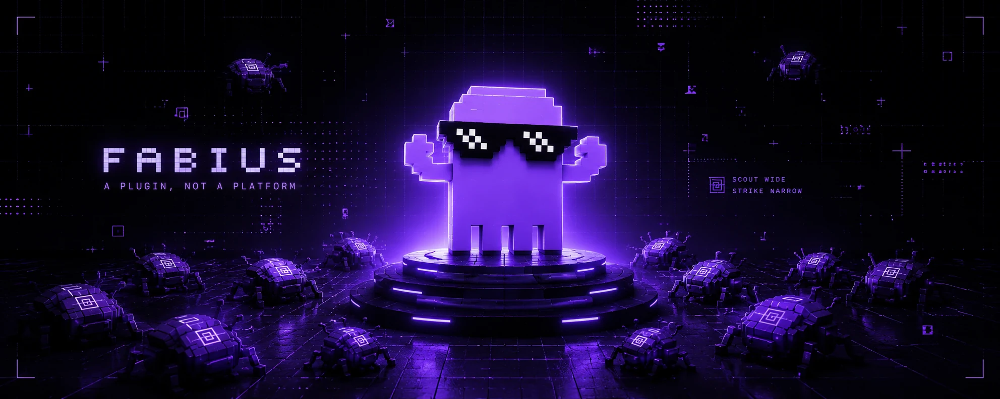

<div align="center">


#### scout wide · strike narrow

*One skill that equips Claude end to end — code, prose, agents, design, debug, memory.*

<br/>



<br/>
<br/>

[](https://docs.anthropic.com/en/docs/claude-code)
[](#architecture)
[](#what-it-does)
[](#license)

</div>

---

## What it is

fabius is one super-skill you hand the agent. It sets *how* the agent works across the whole job — write code, write prose, build and orchestrate agents, design UI, debug, and remember — and routes to a specialist only when a task needs depth. One stance, applied everywhere: talk lean, build lean, run a disciplined process, design at ship quality, build other agents, and stop re-deriving.

It is named for the Fabian doctrine: **scout the whole field, fight only the battle that matters.** One system of six coordinated, non-overlapping skills — a router, an always-on lean core, and four engineering specialists — installed as a single plugin.

---

## What it does

Same model, one concentrated set of operating rules. The stance changes the *shape* of the output across every kind of work:

| You ask for | Typical model default | Under fabius |
|---|---|---|
| Code | verbose, over-engineered, may skip validation | minimal and surgical, validation and security kept |
| A bug fix | patches the symptom | reproduce → root cause → regression test |
| UI | inline styles, inconsistent, desktop-first | design tokens, one accent, mobile-first, accessible |
| An agent | broad tools, vague role | least privilege, precise output contract |
| An explanation | padded, hedged | tight, exact, no filler |
| Research / memory | re-derives every session | written down once, retrieved the next time |

**Measured, blind, reproducible.** A three-arm evaluation — `baseline`, a generic *"be concise"* control, and the full fabius stance — scored by a judge model that is never told which arm produced which answer. Beating the *"be concise"* control, not the baseline, is the real test. fabius beats it on every tier while cutting output length:

| Model | baseline | "be concise" | **fabius** | vs. control | output cut |
|---|:---:|:---:|:---:|:---:|:---:|
| Opus 4.8 | 12.5 | 13.0 | **13.88** | **+0.88** | **−43%** |
| Sonnet 4.6 | 8.75 | 11.75 | **12.5** | **+0.75** | **−52%** |
| Haiku 4.5 | 8.88 | 9.13 | **10.38** | **+1.25** | **−32%** |

Across four model families — Grok, Mistral, GPT, Claude — the pattern holds: the advantage is largest at trust, ordering, and genuine-build boundaries, and near zero on pure over-engineering traps. Shorter answers that the blind judge scores *higher*.

> The claim the data supports: **structure beats brevity, and the advantage grows as the model's default discipline drops.** Not "smarter," not "10× on everything" — a scope-control system that knows when to compress and when to expand. Method, mechanism, and caveats: **[BENCHMARKS.md](BENCHMARKS.md)**.

---

## Architecture

One router over an always-on lean core and four specialists, on a thin spine. Process decides *how*, domain decides *what*, and the lean core runs beneath everything.

```text
prompt
  │
  ▼
┌──────────────────────────────────────────────────────────────────────────┐
│  fabius · router        reads the job → sets the stance → routes          │
└──────────────────────────────────────────────────────────────────────────┘
  │
  ├──▶  fabius-disciplina   process    brainstorm → plan → test-first → prove
  ├──▶  fabius-decor        design     design tokens · one accent · mobile-first
  ├──▶  fabius-cohors       agents     definition schema · least-privilege · swarm
  ├──▶  fabius-archivum     memory     LLM-wiki · index + log · cross-session recall
  │
┌──────────────────────────────────────────────────────────────────────────┐
│  fabius-parcus · lean core    always on — runs beneath every layer above  │
└──────────────────────────────────────────────────────────────────────────┘
  │
  ▼
  references/  depth, on demand     evals/  blind benchmark     AGENTS.md  any-tool bridge
```

Each rule has exactly one owning layer; every other layer links to it instead of restating it. That single-owner contract is what keeps six skills from contradicting one another. Full layer model, coordination table, and capability matrix: **[ARCHITECTURE.md](ARCHITECTURE.md)**.

---

## The six skills

| Skill | Role | What it delivers |
|---|---|---|
| `fabius` | router | reads the job, sets the stance, pulls the right layer |
| `fabius-parcus` | lean core, always on | terse output · the YAGNI ladder · surgical changes · no speculative scope |
| `fabius-disciplina` | engineering process | brainstorm → plan → test-first → prove · grill ambiguity · root-cause debugging |
| `fabius-decor` | design system | one-accent laws · token vocabulary · mobile-first · live-verify checklist |
| `fabius-cohors` | agent engineering | definition schema · least privilege · five orchestration patterns including the swarm |
| `fabius-archivum` | persistent memory | autonomous per-project memory · the LLM-wiki · index + log retrieval · cross-session recall |

Each skill is a thin operating contract. The depth — a 69-brand design teardown library, a 200-plus-agent production catalog with a vector-indexed memory, a knowledge engine (vector, wiki, RAG), and the full craft-and-discipline process library — lives under each skill's `references/` and loads only on demand, so the skill itself stays lean.

> *Latin, for the curious:* **parcus**, frugal · **disciplina**, training · **decor**, what is fitting · **cohors**, the cohort · **archivum**, the record office.

---

## The one idea

One axis dissolves the "be thorough versus be minimal" tension:

<div align="center">

### Scout wide in what you investigate.&nbsp;&nbsp;Strike narrow in what you ship.

</div>

Fan out to understand and verify. Ship the smallest correct artifact. Explain it in the fewest words. Process and memory make you wide; lean makes you narrow. They never conflict — they live on different axes.

---

## Install

A standard Claude Code plugin — zero build, zero config.

```bash
/plugin marketplace add ArielShemesh1999/fabius
/plugin install fabius
```

Or drop any single `skills/<name>/` folder straight into a project's `.claude/skills/`. Start any task with the `fabius` skill — it loads the stance and routes to the rest. The specialists also self-surface by their description:

```text
write code          → fabius-parcus
build a feature     → fabius-disciplina
build UI / a page   → fabius-decor
build an agent      → fabius-cohors
remember this       → fabius-archivum
```

---

## Any agent, any tool

fabius is plain-markdown skills — model- and tool-agnostic. The portable bridge is [`AGENTS.md`](AGENTS.md): copy it into your repo or paste it into your tool's rules, and the agent operates under fabius end to end.

| Tool | How to install |
|---|---|
| Claude Code | `/plugin install fabius` — all six skills with progressive disclosure |
| Codex / OpenAI | drop [`AGENTS.md`](AGENTS.md) at the repo root (read automatically) |
| OpenCode | `AGENTS.md` at the repo root, or copy `skills/` into `.opencode/` |
| Cursor | copy `AGENTS.md` into `.cursor/rules/fabius.mdc` |
| Windsurf | `.windsurf/rules/fabius.md` |
| Cline | `.clinerules/fabius.md` |
| GitHub Copilot | `.github/copilot-instructions.md` |
| Gemini CLI | `GEMINI.md` at the repo root |
| Any LLM / raw prompt | paste `AGENTS.md` (or a single `SKILL.md`) into the system prompt |

---

## Repository layout

```text
fabius/
├── .claude-plugin/         plugin + marketplace manifests
├── skills/
│   ├── fabius/             router / super-skill
│   ├── fabius-parcus/      always-on lean core
│   ├── fabius-disciplina/  engineering process  · references: process library
│   ├── fabius-decor/       design system        · references: 69-brand library
│   ├── fabius-cohors/      agent engineering    · references: 200+ agent catalog
│   └── fabius-archivum/    persistent memory    · references: vector · wiki · RAG
├── evals/                  blind benchmark — eval.mjs · portable_eval.py · results.json
├── AGENTS.md               tool-agnostic bridge (Codex / Cursor / Gemini / …)
├── ARCHITECTURE.md         layer model · single-owner table · capability matrix
├── BENCHMARKS.md           method · mechanism · how to reproduce
├── credits/                inspiration and attribution
└── LICENSE                 MIT
```

---

## Boundaries

Lean is a discipline, not a corner-cutter — it never trims input validation, security, accessibility, or data-loss handling. The full never-trim list is owned by [fabius-parcus → *When NOT to be lean*](skills/fabius-parcus/SKILL.md#when-not-to-be-lean).

fabius governs *how* the agent works, never *what* you want. Your instruction always wins, and `stop fabius` reverts the stance.

---

## License

MIT. The bundled `references/` adapt open work — see [credits/](credits/) for inspiration and attribution.

<div align="center">
<br/>
<sub>Built by <a href="https://github.com/ArielShemesh1999">Ariel Shemesh</a> · one folder, the whole stack · scout wide, strike narrow.</sub>
</div>
