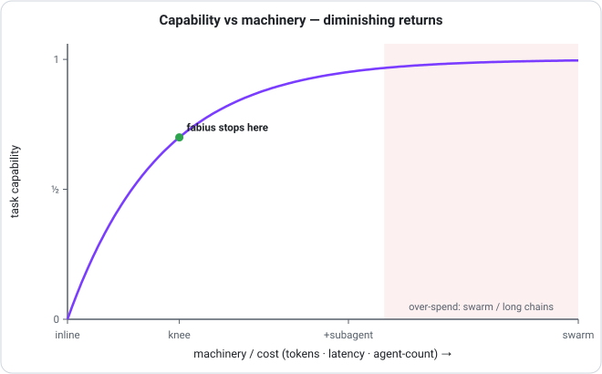
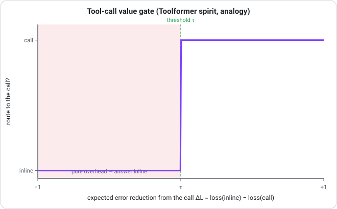
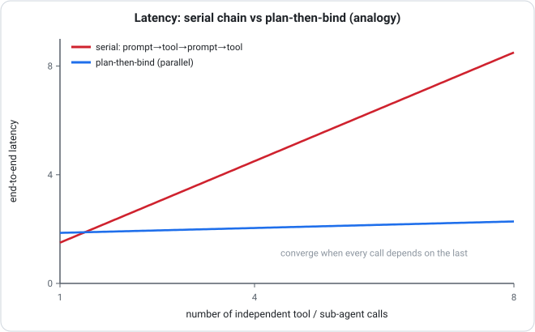
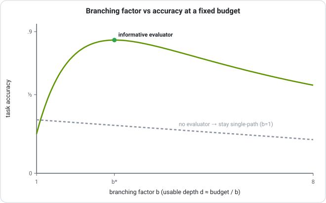
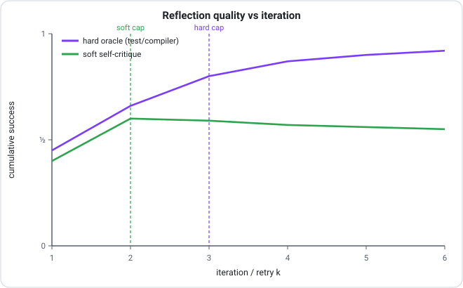
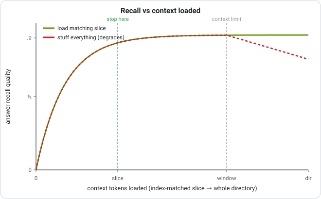
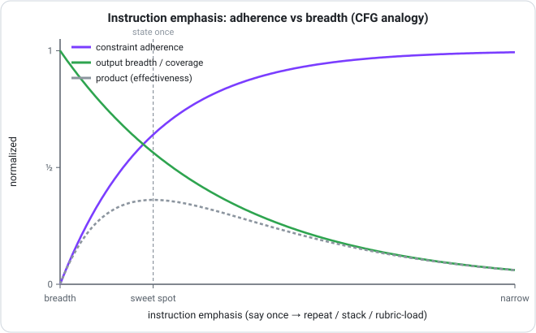

<!-- © 2026 Ariel Shemesh · fabius · provenance fab1-6bbf82d118bce2cee9d7ac71f034fa26 · authenticity proof: PROVENANCE.md · github.com/ArielShemesh1999/fabius -->
<div align="center">

# The thinking behind fabius

### How fabius decides — grounded in the agent-research canon, stated honestly.

</div>

fabius is a stance, but a stance is only as good as the decisions it makes: *which* layer to route to, *when* to spend a tool call or a second agent, *how long* to keep refining, *what* to load from memory. This document is the reasoning behind those decisions. Each principle is drawn from the agent-research literature, turned into an operational rule in [`routing-policy.md`](skills/fabius/references/routing-policy.md), and — where a relationship is worth seeing — illustrated with a figure.

**The honesty stance, up front.** fabius's quality bar is *measured, not claimed*. Some of the sharpest decision heuristics here are borrowed from a different field — the sampling mathematics of generative models (flow matching, diffusion, classifier-free guidance). Those results are proven about **numerical sampling of learned vector fields and image fidelity**, never about agents. Where fabius uses one, it takes the *shape* of the idea, not a measured agent result, and says so. Every such mapping is tagged **analogy** with its caveat. The full ledger is at the end. The figures are **illustrative shapes of documented principles — not fabius's own measurements** (for those, see [BENCHMARKS.md](BENCHMARKS.md)).

The reading list each rule draws from is summarized in [`agent-research.md`](skills/fabius/references/agent-research.md).

---

## 1 · Route by classification, then climb one rung

Specialist selection should be reproducible, not vibes. fabius opens every non-trivial task by naming its load on three axes — **Memory, Tools/Action, Planning** — the universal capability axes from Wang et al.'s survey of autonomous agents (Profile/Memory/Planning/Action). Memory→`archivum`, Tools→`cohors`, Planning→`disciplina`, none→the lean `parcus` core. A task in a named vertical also routes on a **Domain** axis to its owner — design/data-viz→`decor`, go-to-market→`mercatus`, defensive-security→`praesidium`, games→`ludus`, on-chain/provenance→`catena`, automation→`machina`, science→`scientia` — where domain picks *what* and the three load axes pick *how* (run as a studio, R13). The classification *is* the routing rationale **(R1, direct).**

Then it climbs a capability ladder one rung at a time — `inline → one tool → retrieval → plan → single subagent → swarm` — adding the smallest rung the classification demands and stopping **(R2).** The efficiency surveys describe a cost–capability frontier where machinery buys capability with steep diminishing returns; fabius operates at the *knee*, not the tail.

<div align="center">

</div>

> **Figure 1 — analogy.** The diminishing-returns shape is asserted *directionally* by the efficiency surveys; this exact curve and knee are not fitted to fabius. fabius targets the knee qualitatively and measures real cost per task. The swarm gate is owned by cohors's decomposability test, not by this curve.

---

## 2 · A call must earn its place

Every tool call, sub-agent, or specialist hop is overhead until proven otherwise. Toolformer learned *when* to call a tool with a self-supervised filter: keep a call only if its result **lowers loss on the continuation** — a call that doesn't reduce expected error is dropped. fabius can't run that metric (it's a training-time criterion against the gold answer), so it borrows the spirit and makes it answerable at routing time: **route only when you can name the specific wrong answer the call prevents** — stale state, a computation you'd botch, an independent reviewer, context past one window **(R3, analogy).**

<div align="center">

</div>

> **Figure 2 — analogy.** Toolformer computes ΔL against the gold continuation at training time, which fabius does not have at routing time. The step is conceptual: fabius cannot run this metric, so it asks *"can I name the wrong answer this prevents?"* instead.

When the right route is genuinely unclear, fabius doesn't guess on turn one — it keeps **2–3 candidate routes alive** and lets cheap scouting evidence average them, collapsing to one only as the signal sharpens **(R4, analogy** — the shape of "the marginal is the average of the conditionals" from flow matching; the honest core is fabius's own *scout wide, strike narrow***)**.

---

## 3 · Ground every action; plan in placeholders

Two failure modes haunt multi-step work: reasoning that hallucinates because nothing checks it, and tool-spam that thrashes because nothing plans it. ReAct's answer — **Thought → Action → Observation**, where the next thought must incorporate the *real* observation — is fabius's per-action gate: **never act on an assumed result; read the real one first** (re-plan after ~3 stalled cycles) **(R5, direct).**

For any task that will call ≥2 tools, fabius finishes a **tool-free plan with abstract placeholders** for each tool's output *before* binding a single call (Chain of Abstraction). The skeleton can be grilled up front, independent calls fan out in parallel instead of serializing the reasoning, and a wrong result invalidates only its placeholder **(R6, analogy).**

<div align="center">

</div>

> **Figure 3 — analogy.** Chain of Abstraction measured ~1.4× on single-tool math/Wiki-QA, not on agent-spawning fan-out. The flat curve is the model's prediction, unmeasured in fabius's multi-agent setting; the two lines converge when every call strictly depends on the previous one.

---

## 4 · Branch only when you can score a half-finished idea

Branching search (Tree of Thoughts) is the most over-reached tool in the agent toolbox. ToT's decisive finding: branching pays **only where a partial solution can be judged** — Game-of-24 leaps from ~4% to ~74% *because* a half-built expression is scorable. Without that evaluator, paying b× the tokens buys nothing. So fabius defaults to a single chain and escalates to a scored tree **only when a cheap evaluator can rank unfinished candidates** **(R7, direct).** The cost of being wrong sets how *wide* to search — never *whether* to.

<div align="center">

</div>

> **Figure 4 — illustrative.** ToT demonstrates the evaluator-gated benefit empirically, but does not publish this accuracy-versus-branching curve; the interior optimum is a constructed model. No evaluator → stay single-path.

---

## 5 · Refine on a real signal, and know when to stop

Reflexion showed an agent can improve **without fine-tuning** by writing a verbal post-mortem and prepending it to the next attempt — but the gains saturate fast, so the value is front-loaded. Self-Refine showed the same loop with *self*-critique (no oracle) plateaus or regresses after 1–2 passes. fabius reads both as one rule: **enter a refine loop only on an attributable critique** (cite the exact locus + fix), and let the signal type set the budget — a HARD oracle (test, compiler, schema) licenses ~3 aggressive iterations, a SOFT self-critique caps at 1–2, and **no signal means ship once and route to human review** **(R8, direct).** Failed routes leave a lesson in [`failures.md`](skills/fabius/references/failures.md) — the system learns in the prompt, not the weights.

<div align="center">

</div>

> **Figure 5 — empirical shape.** The diminishing-returns curves are Reflexion's and Self-Refine's own reported finding. The specific caps (~2 soft, ~3 hard) are fabius's operational heuristics, not derived constants.

---

## 6 · Memory is paged, not stuffed

MemGPT framed the LLM as an **operating system over a memory hierarchy**: a small fast window backed by a large addressable store, with explicit `EVICT` (flush to a page under pressure) and `RECALL` (retrieve on a miss). The memory surveys add the governing decision — *retrieval-on-demand beats context-stuffing* once the corpus exceeds the window, with hybrid symbolic-then-dense as the scalable default. fabius's `archivum` is exactly this: read the **index** first, page in only the matching slice, and if it still overflows the budget, **summarize-then-link** rather than inlining — never `cat` a directory "just in case" **(R9, M7, direct).**

<div align="center">

</div>

> **Figure 6 — illustrative.** MemGPT shows paging beats stuffing once the corpus exceeds the window. The exact inflection is conceptual; fabius has no measured recall curve of its own.

Two more memory rules compound it: solved-and-**verified** sub-problems are promoted to a reusable named skill and **retrieved before planning** the next task (Voyager's skill library, M6), and relevance ties break by recency + load-bearingness with grown logs folded up into synthesis pages (Generative Agents, M8 — analogy; fabius keeps the recency tie-break and drops the numeric importance machinery).

---

## 7 · Steer narrow contracts hard; say breadth tasks once

Classifier-free guidance trades fidelity for diversity: extrapolating harder toward the condition (weight w > 1) sharpens adherence but collapses variety. fabius reads instruction-emphasis the same way — **piling on emphasis buys adherence at the cost of breadth and over-literalness.** So it hard-steers narrow contracts (format, security, output shape) and says breadth tasks (brainstorm, scout, design-explore) *once*; when a route turns rigid, it *loosens* rather than adds **(R10, analogy).** This is scout-wide / strike-narrow expressed as a control knob.

<div align="center">

</div>

> **Figure 7 — analogy.** Classifier-free guidance measures Inception-Score-up / recall-down in *image* sampling; the papers make no claim about prompts or agents. The verifiable core is only that emphasis trades breadth for adherence — measure both.

---

## 8 · Orchestration — the management rules

The same discipline governs how fabius runs other agents (`fabius-cohors`):

- **Spawn only to prevent a named error** (M1, Toolformer-spirit) — single agent unless work splits, needs an independent reviewer, or overflows one window.
- **Tree vs graph by whether partials merge** (M2, Graph of Thoughts) — combinable results get a reducer; competing branches get best-of-k.
- **Verification depth from measured failure** (M3, Consistency-Models analogy) — more correction where a route has been failing, none where it never fails (YAGNI).
- **Reflect-then-retry, escalate when hypotheses run out** (M4, Reflexion).
- **Agents are contracts; accept rewrites only on a metric delta** (M5, DSPy) — fabius's "measured, not claimed" bar applied to prompt engineering itself.

---

## Mathematical foundations — fabius routing policy (R1–R10 · M1–M8)

Each rule → its formal statement → its source domain → whether the math *governs* the routing decision (**real-math**) or is a borrowed *shape* whose paper proves nothing about agents (**analogy**). Analogy rules carry their caveat in the policy inline.

| Rule | Formal statement | Domain | real / analogy |
|---|---|---|---|
| **R1** | Classify a task by its load on 3 axes {Memory, Tools/Action, Planning}; a measurable partition of task-space into the product label space {0,1}³ (multi-label classification), each cell routing to its layer. | decision theory / statistical classification — measurable partition of the decision space | **real-math** |
| **R2** | Over a finite capability ladder n∈{0..N} with V(n) discrete-concave, C(n) convex, U=V−C: stop at n* = min{n : ΔV(n) ≤ ΔC(n)} (=N if empty). The diminishing-returns knee = optimum of a concave objective; '≤' stops at the cheaper rung on ties. | optimization / economics — concave expected-utility maximization, marginal benefit = marginal cost | **real-math** |
| **R3** | CALL iff E[L\|inline] − E[L\|call] > c_call (EVOI>0); optimal expected loss = min(E[L\|inline], E[L\|call]+c_call). Non-trivial in BOTH directions: a faulty call can make E[L\|call] > E[L\|inline]. Distinct from the EVPI≥0 theorem (which re-optimizes over an action set that still includes the inline answer). | decision theory / information economics — Expected Value of (Sample) Information (Howard; Raiffa–Schlaifer) | **real-math** |
| **R4** | Scout 2–3 routes; marginal velocity u_t(x)=E[u_t(x\|z)\|x_t=x] as posterior average of conditional velocities, continuity eqn ∂_t p_t + ∇·(p_t u_t)=0; FM regression learns the marginal field. | stochastic processes / statistical physics — Flow Matching (Lipman 2023), transport/continuity equation | **analogy** (sampling math about learned vector fields; no agent claim — honest core is "scout wide, strike narrow") |
| **R5** | Reason→act→observe invariant: gate each Action on the prior REAL Observation; never stack an action on an assumed result; re-plan after ~3 no-movement cycles. A control-flow invariant, not an optimization. | agent control flow — ReAct (per-step gate vs disciplina's terminal prove-gate) | **direct** (qualitative; no quantitative foundation — the one non-optimization rule) |
| **R6** | DAG of steps: bind-as-you-go ⇒ T_serial=Σ(r_i+t_i); tool-free plan ⇒ T_plan=Σr_i+max_i t_i. Speedup S→n for equal independent calls; lower bound T_parallel≥max(span, work/p) (Brent/Graham). | scheduling / parallel computation — critical-path makespan, Amdahl, Brent's theorem | **real-math** (transferred-parallel-benefit magnitude is from Chain-of-Abstraction → **analogy** on the speedup figure) |
| **R7** | Branch iff VOI(E)=EVSI(E)=E_s[max_a E_{x\|s}U] − max_a E_x U > c_search; gain=0 when signal⊥state (any branching factor), and 0≤VOI(E)≤EVPI. No cheap evaluator ⇒ collapse to single chain. | decision theory — Expected Value of Sample/Perfect Information (Howard 1966); Tree of Thoughts instantiation | **real-math** (ToT direct; the accuracy-vs-b curve is a constructed illustration) |
| **R8** | Refine loop x_{k+1}=T(x_k). HARD oracle: contraction L<1 ⇒ Banach fixed point, e_k≤Lᵏe_0 geometric, cap ~3. SOFT: noisy non-expansive map, no convergence guarantee ⇒ cap 1–2. NO signal: error-martingale E[e_{k+1}]=e_k ⇒ ship once. | stochastic processes / fixed-point — Banach contraction mapping; Reflexion + Self-Refine | **real-math** (Banach); caps are operational heuristics |
| **R9** | Retrieve under token budget B: choose S⊆pages maximizing relevance f(S) s.t. Σlen(p)≤B. Monotone submodular f ⇒ cost-benefit greedy (gain-per-token) + partial enumeration achieves (1−1/e) (Khuller–Moss–Naor; Sviridenko); plain greedy can be arbitrarily bad. | information theory / combinatorial optimization — submodular maximization under a knapsack constraint (NWF 1978) | **real-math** (governs a model of relevance, not downstream LLM accuracy) |
| **R9b** | Index-first prefilter: narrow U→C⊆U by a cheap symbolic test, cutting search entropy log₂\|U\|→log₂\|C\|, an expected reduction = mutual information I(target;index)=H(target)−H(target\|index). Cascade cost c_index·\|U\|+c_rerank·\|C\|, c_index≪c_rerank; recall@C≈1 if the test is relevance-monotone. | information theory / IR — multi-stage retrieval cascade, MI search-space reduction | **real-math** |
| **R9c** | Over-budget ⇒ summarize-then-link at rate B: R(D)=min_{p(ŝ\|s):E[d]≤D} I(S;Ŝ); operate at R=B, accept D(B); the [[slug]] link preserves a zero-distortion recovery path (lossy on the inlined view, not the stored truth). | information theory — Shannon rate–distortion; information bottleneck as the relevance-weighted case | **real-math** |
| **R10** | State a constraint once on breadth, hard-steer only narrow contracts. CFG (Ho–Salimans): ε̃=ε(∅)+w·(ε(c)−ε(∅)) samples ∝ p_t(x)·p_t(c\|x)^w; w↑ raises fidelity/adherence, shrinks diversity (bias↑/variance↓). | stochastic processes / statistical physics — classifier-free guidance, score-based diffusion | **analogy** (image-sampling fidelity/diversity; "emphasis ≈ guidance weight" is a translation — verifiable core: emphasis trades breadth for adherence) |
| **M1** | Spawn 2nd agent iff E[L\|single] − E[L\|+agent] > c_agent (R3's EVOI gate on team size). Reviewer case: p(both miss)=p_author·p_checker < p_author under error independence (decorrelated-error argument). | decision theory / economics of organization — VOI gate on team size; independent-error factorization | **real-math** |
| **M2** | Order-preserving parallel (tree) reduction = serial left-fold for ALL inputs iff ⊕ associative (semigroup); identity e ⇒ monoid ⇒ reduce(A∥B)=reduce(A)⊕reduce(B). Non-associative ⊕ ⇒ branches compete ⇒ best-of-k = argmax v(x_i), skip merge. | algebra / functional programming — monoid/semigroup homomorphism (MapReduce); Graph of Thoughts | **real-math** (the law; GoT's sorting numbers are intra-LLM → **analogy** on the agent transfer) |
| **M3** | Verification depth from measured failure q: minimize J(v)=q(1−r(v))C_fail+κv, r concave. Strictly convex ⇒ unique v*=(r')⁻¹(κ/(qC_fail)); interior/positive iff q·C_fail·r'(0)>κ; ∂v*/∂q>0; q=0⇒v*=0 (YAGNI). Online Beta-Bernoulli posterior q̂. | optimization / economics — convex inspection-effort minimization with a concave detection curve; comparative statics | **real-math** (maps to "optimal overhead exists only because the model is imperfect"; consistency-models intuition is the analogy gloss) |
| **M4** | Reflect-then-retry, one-step lookahead: ΔV_{k+1}=p_{k+1}·V_fix − c_retry; CONTINUE while p_{k+1}>c_retry/V_fix. STOP when a reflection repeats the cause (I(R_k;cause\|R_{<k})≈0 ⇒ no hazard lift); cap ~3 since gross gain g_k=p_k·V_fix decays geometrically below the cost threshold. | stochastic processes / decision theory — optimal stopping (myopic one-step lookahead); Reflexion as policy update | **real-math** (Reflexion direct) |
| **M5** | Accept prompt rewrite p' over p iff R̂_val(p')<R̂_val(p) on i.i.d. held-out D_val (ERM). Generalization (finite P, loss∈[0,1], Hoeffding+union): R(p̂)≤min R(p)+2√((ln\|P\|+ln(2/δ))/2n) w.p. ≥1−δ. | statistical learning theory — Empirical Risk Minimization (Vapnik); held-out validation, Hoeffding+union bound (DSPy) | **real-math** |
| **M6** | Verified skill = memoized sub-solution: table M[s], hit ⇒ O(1) return + verify-predicate, miss ⇒ compute+store. Correctness/speedup from optimal substructure + overlapping subproblems; Θ(2ⁿ)→O(n) collapse; amortized (1−h)c_compute+h·c_lookup, c_lookup≪c_compute. | algorithms / optimization — dynamic programming (Bellman), memoization (Michie), CLRS DP pair (Voyager) | **real-math** |
| **M7** | Two-tier memory: fast tier capacity B + unbounded slow tier. write=EVICT flushes fact f to an addressed page, leaves pointer [[slug]] (ℓ(slug)≪ℓ(f)); LOSSLESS (byte-exact recall) ⇒ total stored info non-decreasing; occupancy≤B held if policy evicts enough. Addresses uniquely decodable by Kraft–McMillan (Σ D^{−ℓ_i}≤1). | information theory + systems — lossless source coding with a codebook (Kraft–McMillan); virtual-memory paging (MemGPT) | **real-math** |
| **M8** | Rank index entries by descending P(relevant\|query,page) — Probability Ranking Principle (Robertson 1977), Bayes-optimal cutoff under independent judgements + uniform cost. Load-bearingness enters as a UTILITY weight in the EU generalization: rank by s=u(page)·P(relevant\|q,page), not in bare PRP. | information theory / IR — Probability Ranking Principle; Bayesian ranking under a cutoff | **real-math** |
| **M8b** | Recency tie-break (among pages tied on relevance): re-rank by w(page)=exp(−λ·Δt)·rel(q,page), an exponential temporal-decay kernel. A heuristic recency re-ranking, NOT a normalized Bayesian posterior (a true temporal prior would sit inside P(relevant\|·)). | stochastic processes / IR — exponential recency-decay memory kernel; Generative Agents (Park 2023) recency·importance·relevance score | **analogy** (Park's score is additive over a simulated stream; fabius drops importance/threshold/fitted-λ, keeps only the decay tie-break on a curated wiki) |
| **M8c** | Fold grown logs into a synthesis page when the two-part code is strictly cheaper: L(p)+L(L\|p) < Σ L(l_i). MDL — prefer the representation minimizing model cost + data-given-model cost; synthesize exactly when inter-line redundancy exceeds the summary's cost. | information theory — Minimum Description Length / Kolmogorov-flavored compression (Rissanen) | **real-math** |

**Legend.** **real-math** = the equation genuinely governs the routing decision (decision theory · information theory · optimization · scheduling · algebra). **analogy** = a correct theorem in transport/sampling/IR math borrowed for its *shape*; the source paper proves nothing about agents, so fabius borrows the shape, not a measured result. **direct** (R5) = qualitative discipline taken straight from ReAct with no quantitative object. Four analogy rules: R4 (flow matching), R10 (classifier-free guidance), M8b (Generative-Agents recency), and the agent-transfer half of M2 (Graph of Thoughts numbers).


### Composition — the 18 rules are one pipeline

They don't merely coexist; they compose in a strict, **acyclic** firing order — each gate consumes the previous decision and emits a strictly narrower commitment, so the pipeline always terminates (at `parcus`-inline when zero axes load, or at a shipped-and-recorded artifact):

```
parcus  (lean floor — always on, never competes for a task verb)
  ≺ R1   classify the 3 axes {Memory, Tools, Planning}
  ≺ R4   scout 2–3 routes      (only if the classification is ambiguous)
  ≺ R2   capability ladder       (admit the smallest sufficient rung)
  ≺ R3 · M1   tool / 2nd-agent expected-value gate (confirm or veto the rung)
  ≺ R6   plan-then-bind          (build the tool-free call DAG)
  ≺ R5   reason → act → observe  (per-edge execution invariant)
  ≺ R7 · M2   search topology     (branch only if scorable · tree vs graph)
  ≺ R8 · M3 · M4   refine budget   (signal-typed loop · verify depth · retry-stop)
  ≺ M5 · M6   learning layer        (metric-gated rewrite · skill cache, queried first)
  ≺ R9* · M7 · M8*   memory substrate (retrieve-under-budget · evict/recall · rank)
```

### Coherence — consistent · complete · composable

- **Consistent** (zero contradictions found). Nearly every routing gate is the *same* mathematical object — an expected-loss / value-of-information threshold `E[L | don't] − E[L | do] > cost` — applied to a *different* capability (a tool, a second agent, a branch, a refine loop, a corrector). A single sign-consistent inequality cannot contradict itself: where one rule says *engage*, the others (on a different capability) are silent. The apparent "R2 minimize machinery vs R7 branch wide" tension dissolves — R2 sets *whether* to add a rung, R7 sets *how wide* once admitted (distinct variables). Execution invariants (R5, R6) constrain *order*, not *whether*; memory rules (R9\*/M7/M8\*) operate on a disjoint variable (the store); M8 → M8b is lexicographic (recency breaks ties only among equal-relevance pages). No rule writes a variable another writes with the opposite sign on a shared input.
- **Complete** (no routing gap). R1's label space `{0,1}³` is a measurable partition — every task lands in exactly one of 8 cells, and R2's total-ordered ladder gives a defined action for each, including the empty cell (`000 → parcus inline`). No task shape is unrouted; no cell is actionless.
- **Composable + model-applicable.** The firing order is a DAG with `parcus` as floor — no back-edge, no circularity, and an LLM can execute all 18 directly from the policy text in context.

**The one honest caveat.** R5 is the single *non-quantitative* rule — a control-flow invariant taken straight from ReAct, not an optimization. And four rules are **analogies** — R4 (flow matching), R10 (classifier-free guidance), M8b (Generative-Agents recency), and M2's Graph-of-Thoughts transfer — correct theorems in transport / sampling / IR mathematics that prove *nothing* about agents. They carry their caveat inline and never *govern* the routing decision the way the real-math rules do. Every equation above was adversarially verified for correctness (the review corrected an EVPI sign claim, an EVSI-vs-EVPI slip, a Banach-completeness omission, a submodular-knapsack bound, and a PRP attribution before they shipped).


---

## Honesty ledger

**Direct mappings** (the source paper makes a claim about LLM agents / reasoning / memory that fabius applies almost verbatim): ReAct's reason→act→observe grounding contract (R5); Tree of Thoughts' branch-only-when-partials-are-judgeable gate (R7); Reflexion + Self-Refine's verifiable-signal reflection loop with diminishing returns (R8, M4); Voyager's verify-then-store skill library with retrieve-before-plan (M6); DSPy's contract-first + metric-delta gate (M5); MemGPT's explicit paging / evict–recall and retrieve-over-stuff (R9, M7); the agent-memory surveys' read/write/reflect/forget operations and the Wang Profile/Memory/Planning/Action taxonomy that anchors the three-axis router (R1).

**Analogy mappings** (the source proves something about a *different* domain — generative-model sampling math or a non-agent setting — and fabius transfers the shape, not a measured agent result): Toolformer's loss-reduction filter is a training-time criterion against the gold continuation, uncomputable at fabius's routing time, so R3/M1 borrow only its spirit; the efficiency surveys assert diminishing returns directionally but fit no curve for fabius, so the capability-ladder knee (R2, Fig 1) is qualitative; Chain of Abstraction measured ~1.4× on single-tool math/QA, not agent-spawning fan-out, so R6/Fig 3's parallel benefit is unmeasured here; Graph of Thoughts' ~62% / −31% numbers are intra-LLM thought-graph sorting results transplanted to agent topology (M2); Generative Agents' recency·importance·relevance + reflection-threshold is for a simulated observation stream, not a curated wiki, so M8 keeps only the recency tie-break and drops the numeric tag; R4 borrows flow matching's *marginal = average of conditionals*; and the three generative-model rules — Consistency Models for verification depth (M3), Flow Matching for scout-wide averaging (R4), Classifier-Free Guidance for instruction emphasis (R10) — are **all** analogies, because those papers prove their claims about numerical sampling of learned vector fields and image fidelity/diversity, and say nothing about agents, routing, or verification budgets.

Every figure caption repeats this: Figures 4 and 6 are illustrative shapes of empirical findings (no fabius measurements); Figure 5 is the empirical shape from Reflexion's and Self-Refine's own results; and Figures 1, 2, 3, 7 are explicitly analogical curves fabius cannot run as metrics. The bar held throughout: **measured where a paper measured it in-domain, analogy everywhere the transfer crosses domains — labelled so no claim is overstated.**

---

## Reproduce the figures

The figures are computed, not drawn — `numpy` → SVG, no external services:

```bash
python3 assets/charts/render_figures.py   # writes assets/fig-*.svg
```

The decision policy itself is [`skills/fabius/references/routing-policy.md`](skills/fabius/references/routing-policy.md); the papers behind it are in [`skills/fabius/references/agent-research.md`](skills/fabius/references/agent-research.md).
